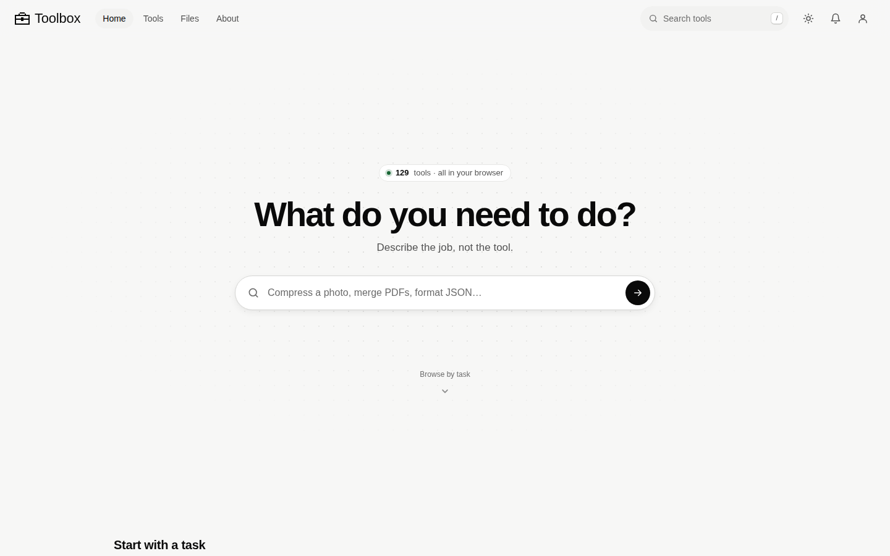

# Toolbox

**129 everyday and specialist tools in one fast web app, with an AI assistant that can use all of them.**

Compress an image, balance a chemical equation, digest a court judgment, draft an invoice or run some Python, all from one page with no sign-up. Most tools run entirely in your browser, so your files stay on your device. Accounts are optional and only add cloud sync, and live Spaces let you collaborate peer to peer.



## What's inside

Every tool is registered in [`js/registry/tools.js`](js/registry/tools.js), the single source of truth for names, categories and search. Categories are defined in [`js/registry/schema.js`](js/registry/schema.js).

| Category | Tools | Examples |
| :--- | ---: | :--- |
| Images & Files | 13 | Image Compressor, Image Converter, Image Resizer, AI Watermark Remover |
| Text | 12 | Word Counter, Case Converter, Find & Replace, Remove Duplicates |
| Developer | 18 | JSON Formatter, CSV to JSON, Base64 Codec, JWT Decoder, Code Playground |
| Numbers & Calculators | 10 | Calculator, Unit Converter, Percentage Calculator, Business Days |
| Business & Finance | 24 | Invoice Generator, VAT & Sales Tax, Break-Even Analysis, Amortization Schedule |
| Law & Legal Practice | 5 | Case Digest, Case Comparator, Legal Document Analyzer, Legal PDF Bundle |
| Science & Chemistry | 4 | Periodic Table, Chemical Equation Balancer, Stoichiometry, Compound Database |
| Design | 5 | Color Converter, Color Palette, Contrast Checker, QR Generator |
| Security & Privacy | 2 | Password Generator, File Checksum |
| Networking | 11 | Subnet Calculator, IP Lookup, DNS Lookup, WHOIS Lookup |
| 3D & Modeling | 3 | Anatomy Explorer, Container Quote Builder, Architecture Editor |
| Reference | 5 | Automobile Guide, Wiki, Dictionary, Bible, Quran |
| Music | 7 | Metronome, Instrument Tuner, Chord & Scale Finder, Spotify Player |
| Everyday | 10 | Timer & Stopwatch, Weather Forecast, Interactive Map, Calendar |

On top of the tools sit the **Assistant** (Google Gemini, able to run any tool, read PDF/Word/Excel files and chain tasks), **Spaces** (WebRTC rooms for live collaboration), mail, messaging and optional Supabase cloud sync.

## Tech stack

- **Frontend:** vanilla ES modules and a hash router, bundled with [Vite](https://vitejs.dev). Three.js for 3D, pdf.js and pdf-lib for PDFs, Yjs for collaboration.
- **API server:** Node (`server.js`), which serves `/api/*` (Assistant, mail, device specs, supporters) and the WebSocket signaling relay for Spaces. In development the same API runs inside the Vite dev server.
- **Data and auth:** [Supabase](https://supabase.com) (Postgres, auth, row-level security).
- **Hosting:** static site and edge Worker on Cloudflare, Node API on Render.

## Getting started

Requires Node 20 or newer.

```bash
git clone https://github.com/the-meyiwa/toolbox.git
cd toolbox
npm install
cp .env.example .env   # then fill in the keys you need
npm run dev            # http://localhost:3000
```

The app runs without any keys. Individual features light up as you add them:

| Variable | Needed for |
| :--- | :--- |
| `VITE_SUPABASE_URL`, `VITE_SUPABASE_ANON_KEY` | Accounts, cloud sync, messaging |
| `GEMINI_API_KEY` | The Assistant and AI-powered tools |
| `GOOGLE_CLIENT_*`, `MICROSOFT_CLIENT_*`, `MAIL_OAUTH_STATE_SECRET` | Mail |
| `ICECAT_USERNAME`, `ICECAT_API_TOKEN` | Device comparisons ([setup](docs/device-comparisons.md)) |
| `SUPABASE_SERVICE_ROLE_KEY`, `FLUTTERWAVE_*` | Contributions and supporter perks ([setup](docs/supporter-setup.md)) |

Server-only secrets must never carry the `VITE_` prefix, because Vite ships those to the browser. See [`.env.example`](.env.example) for the full list with notes.

### Scripts

| Command | What it does |
| :--- | :--- |
| `npm run dev` | Vite dev server with the API mounted at `/api/*` |
| `npm run build` | Production build into `dist/` |
| `npm run preview` | Serve the production build locally |
| `npm start` | Run the standalone Node API and signaling server (port `4444` by default) |
| `npm test` | Run the test suite in `tests/` |
| `npm run vehicle:*` | Build 3D vehicle packages for the Automobile Guide ([details](docs/automobile-viewer.md)) |

## Supabase setup

1. Create a Supabase project and copy its URL and anon key into `.env`.
2. In the SQL Editor, run [`supabase/setup.sql`](supabase/setup.sql). It is idempotent and creates the core tables and policies.
3. Run the feature scripts you need: `assistant_conversations.sql`, `messaging.sql`, `mail_accounts.sql` and `supporters.sql`.
4. Optionally paste the templates in [`supabase/email-templates/`](supabase/email-templates) into Authentication → Email Templates, and enable Google or GitHub under Authentication → Providers for social sign-in.

## Deploying

Production is split in two:

**Node API on Render.** Create a Web Service from this repo with build command `npm install` and start command `npm start`, and add the server-side variables from `.env.example`. Render sets `PORT` for you. `/health` returns a simple status check.

**Frontend on Cloudflare.** [`wrangler.jsonc`](wrangler.jsonc) serves the Vite build in `dist/` as static assets and routes `/api/*` through [`worker/index.js`](worker/index.js), which forwards requests to the Render API. That keeps the API same-origin for the browser. A cron trigger pings Render every ten minutes so the free plan doesn't sleep.

```bash
npm run build
npx wrangler deploy
```

Set `BACKEND_URL` in `wrangler.jsonc` to your Render service URL. Because `VITE_*` variables are baked in at build time, have them in `.env` (or the build environment) before `npm run build`.

## Project layout

```
index.html            App shell
js/registry/          Tool registry, categories and search metadata
js/tools/             One module per tool (the id is the filename and URL hash)
js/lib/               Shared engines: AI provider, PDF, files, Supabase, Spaces
css/                  Styles
public/               Static assets: 3D models, playground runtimes, vendor code
server*.js            Node API and signaling server
worker/               Cloudflare Worker that proxies /api/* to the Node API
supabase/             SQL schema and email templates
scripts/              Build scripts for vehicle packages
tests/                Test runner and suites
docs/                 Architecture and feature documentation
```

## Adding a tool

Add an entry to `js/registry/tools.js` and create `js/tools/<id>.js` exporting `render()`. Write `intents` in the words a person would search with ("compress photo", not "image compression"). The [Implementation Guide](docs/IMPLEMENTATION_GUIDE.md) covers the lifecycle hooks and shared engines.

## Documentation

- [Documentation index](docs/README.md)
- [Architecture](docs/ARCHITECTURE.md)
- [Implementation and tool reference](docs/IMPLEMENTATION_GUIDE.md)
- [Platform integration](docs/INTEGRATION_GUIDE.md)
- [Assistant quick start](docs/ASSISTANT_QUICKSTART.md) and [integration guide](docs/ASSISTANT_INTEGRATION_GUIDE.md)
- [Code Playground](docs/code-playground.md)
- [Automobile Guide](docs/automobile-viewer.md)
- [Device comparisons](docs/device-comparisons.md)
- [Supporter setup](docs/supporter-setup.md)
- [Latest audit](docs/toolbox-audit.md)
