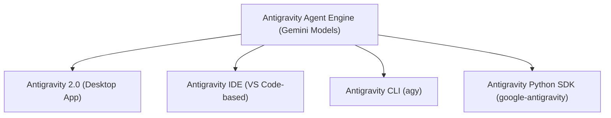
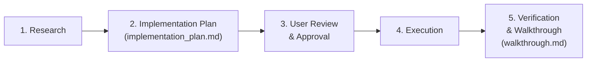

# Google Antigravity (AGY) — Comprehensive Help & Reference Guide

Google Antigravity is an AI-first software development platform providing autonomous agent orchestration, collaborative pair programming, and multi-surface AI tooling.

---

## 1. Surfaces & Interfaces

Antigravity operates across four primary surfaces sharing the same underlying agent engine and customization model:



### 1.1 Antigravity 2.0 (Desktop Application)
Antigravity 2.0 is a standalone desktop application that monitors and orchestrates agent workflows independently of any editor.
- **Left-hand Navigation Sidebar**:
  - **Conversations**: Manage multi-turn sessions with automatic session persistence.
  - **Projects / Workspaces**: Switch between project workspaces and VCS roots.
  - **Scheduled Tasks**: View active cron jobs and one-shot delayed timers.
  - **Customizations**: Manage loaded skills, project rules, plugins, and MCP servers.
  - **Settings**: Global and workspace-level permission gates, model selection, sandboxing, and execution policies.
- **Chat Canvas**:
  - Interactive multi-modal input supporting text, drag-and-drop images, screenshots, and attached files.
  - Slash command autocompletion (`/`).
  - Context attachment via `@` mentions.
- **Auxiliary Pane**:
  - Live inspection tabs for **Subagents**, **Background Tasks**, **Artifacts**, **Files Changed**, and **Terminals**.

### 1.2 Antigravity IDE
An AI-first IDE built on VS Code integrating agent capabilities directly into code editing:
- **Passive Modality (Antigravity Tab / Autocomplete & Supercomplete)**:
  - Context-aware code completions predicting your next edit.
  - **Tab to Jump**: Navigates cursor to the predicted next edit location.
  - **Tab to Import**: Automatically generates missing module imports.
  - Supercomplete suggests multi-line deletions and refactors in floating diff windows.
- **Instructive Modality (Inline Command — `Ctrl+I` / `Cmd+I`)**:
  - Highlight code and invoke inline edits, refactors, documentation generation, or unit test creation localized strictly to the selection.
- **Collaborative Modality (Sidebar Chat & Agent Mode)**:
  - Dedicated agent conversation pane with workspace-wide file read/write, terminal command execution, web research, and tool use.
- **Inline Code Lenses & Diff Overlays**:
  - Direct lenses ("Refactor", "Explain", "Generate Tests") above class and function declarations.
  - Visual inline red/green diff review before accepting agent modifications.

### 1.3 Antigravity CLI (`agy`)
A terminal-based interface (TUI) for headless environments and fast command-line interaction:
- **Launch**: Run `agy` in your terminal.
- **Commands**:
  - `agy --help`: Displays CLI flags and subcommands.
  - `/help`: Lists interactive slash commands within the TUI session.
- **Configuration**: Managed in `~/.gemini/antigravity-cli/settings.json`.

### 1.4 Antigravity Python SDK (`google-antigravity`)
Public SDK for embedding Antigravity agents in automated testing, backend pipelines, and orchestration scripts:
- **Installation**:
  ```bash
  pip install google-antigravity
  ```
- **Example Usage**:
  ```python
  import asyncio, sys
  from google.antigravity import Agent, LocalAgentConfig, CapabilitiesConfig

  async def main():
      config = LocalAgentConfig(
          system_instructions="You are an expert codebase assistant.",
          capabilities=CapabilitiesConfig(), # Enables write tools
      )
      async with Agent(config) as agent:
          response = await agent.chat("Analyze repository architecture.")
          async for token in response:
              sys.stdout.write(token)
              sys.stdout.flush()

  if __name__ == "__main__":
      asyncio.run(main())
  ```

---

## 2. Slash Commands

Slash commands automate complex workflows and engage specialized agent execution modes:

| Command | Purpose | When to Use |
| :--- | :--- | :--- |
| `/goal` | **Autonomous Goal Execution** | Long-running tasks (e.g. overnight builds, major migrations) that run persistently until fully validated. |
| `/schedule` | **Task Scheduler & Timers** | Set up recurring cron schedules (e.g., hourly health checks) or one-shot notification timers. |
| `/browser` | **Browser Automation** | Web scraping, testing web applications, researching documentation, and interacting with live web interfaces. |
| `/grill-me` | **Interactive Design Interview** | Agent interviews you with targeted questions to resolve architectural ambiguities before writing code. |
| `/teamwork-preview` | **Multi-Agent Coordination** | Deploys teams of specialized autonomous subagents working in parallel. |
| `/learn` | **Rule Learning & Persistence** | Distills complex setups or corrections into permanent project rules for future conversations. |
| `/boost` | **Deep Strategic Planning** | Engages multi-perspective deep reasoning, adversarial review, and thorough verification for complex changes. |

---

## 3. Context Injection & Directives

### 3.1 `@` Mentions
Type `@` in the chat canvas to attach specific context:
- **Files & Folders**: Attach specific code files or directories directly to the conversation.
- **Previous Conversations**: Link context and memory from earlier sessions.
- **Terminal Sessions**: Reference terminal output or logs.
- **Rules**: Explicitly link active rule documents.
- **MCP Servers & Tools**: Direct the agent toward specific Model Context Protocol tool capabilities.

### 3.2 Rules System
Rules define guidelines, architectural constraints, and coding standards.

- **Discovery Locations**:
  - Workspace Rules: `.agents/rules/*.md`, `GEMINI.md`, `AGENTS.md` at repository root.
  - Global Rules: `~/.gemini/config/rules/`.
- **Precedence Order**:
  1. Workspace rules (project-specific root).
  2. Hierarchical rules (nearest parent directory walking down to file).
  3. Global user configuration (`~/.gemini/config/`).
- **Progressive Disclosure**:
  - `always_on`: Loaded into context unconditionally on every turn.
  - `model_decision`: Loaded dynamically only when relevant to the user request.

---

## 4. Customization System

Antigravity provides a modular customization system:

| Type | Configuration File | Scope | Use Case |
| :--- | :--- | :--- | :--- |
| **Rules** | `.agents/rules/*.md`, `GEMINI.md` | Contextual / Hierarchical | Enforcing coding styles, architectural boundaries, and constraints. |
| **Skills** | `skills/<name>/SKILL.md` | Progressive / On-Demand | Multi-step runbooks, specialized tools, domain knowledge. |
| **Plugins** | `plugins/<name>/plugin.json` | Package Bundle | Bundling related skills, rules, and MCP servers together. |
| **Hooks** | `hooks.json` | Event Lifecycle | Running scripts before or after specific tool calls. |
| **MCP Servers** | `mcp_config.json` | External Tooling | Connecting external API servers, database tools, and services via Model Context Protocol. |

### 4.1 Skill Structure
A skill resides in `skills/<skill_name>/` and contains:
```
skills/my-skill/
├── SKILL.md          # Frontmatter (name, description) + instructions
├── scripts/          # Helper scripts executed by the agent
├── references/       # Detailed reference documentation
└── examples/         # Sample code and patterns
```

---

## 5. Subagent Architecture

Agents can spawn and coordinate subagents to parallelize work and isolate context:

- **Built-in Subagents**:
  - `self`: Inherits parent agent configuration, system prompt, and tools in an isolated context window.
  - `research`: Read-only agent specialized in broad codebase exploration and web lookups.
  - `flutter_a11y_agent`: Specialized accessibility reviewer.
- **Subagent Lifecycle Operations**:
  - `invoke_subagent`: Launch one or more subagents concurrently.
  - `define_subagent`: Dynamically create a specialized subagent type during the session.
  - `send_message`: Communicate with running subagents asynchronously.
  - `manage_subagents`: List, inspect, or terminate running subagents.

---

## 6. Planning & Execution Lifecycle

For complex or architectural tasks, Antigravity operates in **Planning Mode**:



1. **Research**: Read-only exploration of the codebase, dependencies, and constraints.
2. **Implementation Plan**: Generation of `implementation_plan.md` artifact specifying user review items, open questions, and exact proposed file modifications.
3. **User Approval**: Halts execution to obtain user review and feedback.
4. **Execution**: Systematic implementation of proposed changes using write and edit tools.
5. **Verification**: Automated testing, linting, and generation of `walkthrough.md` summarizing changes and validation results.

---

## 7. Security Policies & Sandboxing

Antigravity provides granular controls over what tools the agent can execute:

- **Tool Execution Policy**:
  - `always-proceed`: Executes tools automatically without prompting.
  - `request-review`: Prompts for user confirmation before executing commands.
  - `strict`: Rejects destructive commands unless explicit permission is granted.
  - `proceed-in-sandbox`: Runs all shell execution in an isolated terminal sandbox.
- **File System Boundaries**:
  - Restricts read/write operations to the active workspace by default.
  - Non-workspace access requires explicit user confirmation or configuration grant.
- **Network Access**:
  - Configurable domain allowlists to control which external APIs and web domains the agent can contact.

---

## 8. Official Documentation & Links

- **Main Documentation**: [https://antigravity.google/docs](https://antigravity.google/docs)
- **Skills Guide**: [https://antigravity.google/docs/skills](https://antigravity.google/docs/skills)
- **Rules & Workflows**: [https://antigravity.google/docs/rules-workflows](https://antigravity.google/docs/rules-workflows)
- **Model Context Protocol (MCP)**: [https://antigravity.google/docs/mcp](https://antigravity.google/docs/mcp)
- **Python SDK**: [https://github.com/google-antigravity/antigravity-sdk-python](https://github.com/google-antigravity/antigravity-sdk-python)
- **Changelog & Release Notes**: [https://antigravity.google/changelog](https://antigravity.google/changelog)
- **Support & Troubleshooting**: [https://antigravity.google/support](https://antigravity.google/support)
